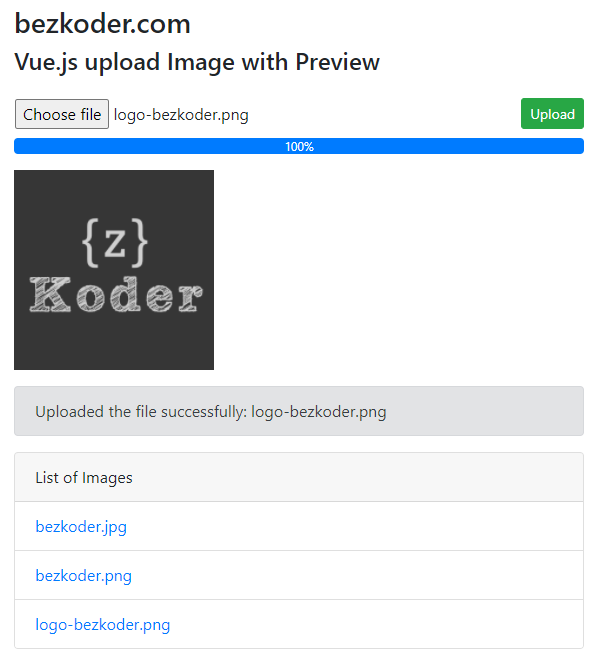

# Vue Upload Image with Axios and Preview example
Build Vue.js Image Upload with Preview to Server example using Axios for HTTP post FormData with progress bar.



For instruction, please visit:
> [Vue Upload Image Axios and Preview tutorial](https://bezkoder.com/vue-upload-image-axios/)

More Practice:
> [Vue File Upload example using Axios](https://bezkoder.com/vue-axios-file-upload/)

> [Vue.js Multiple Files Upload with Progress Bars example](https://bezkoder.com/vue-js-multiple-files-upload/)

> [Vuetify File Upload example](https://bezkoder.com/vuetify-file-upload/)

Rest APIs server for this Vue Client:
> [Node.js Express File Upload Rest API example](https://bezkoder.com/node-js-express-file-upload/)

> [Node.js Express File Upload with Google Cloud Storage example](https://bezkoder.com/google-cloud-storage-nodejs-upload-file/)

> [Spring Boot Multipart File upload example](https://bezkoder.com/spring-boot-file-upload/)

Fullstack CRUD App:
> [Vue.js + Node.js + Express + MySQL](https://bezkoder.com/vue-js-node-js-express-mysql-crud-example/)

> [Vue.js + Node.js + Express + PostgreSQL](https://bezkoder.com/vue-node-express-postgresql/)

> [Vue.js + Node.js + Express + MongoDB](https://bezkoder.com/vue-node-express-mongodb-mevn-crud/)

> [Vue.js + Spring Boot + Embedded Database example](https://bezkoder.com/spring-boot-vue-js-crud-example/)

> [Vue.js + Spring Boot + MySQL example](https://bezkoder.com/spring-boot-vue-js-mysql/)

> [Vue.js + Spring Boot + PostgreSQL example](https://bezkoder.com/spring-boot-vue-js-postgresql/)

> [Vue.js + Spring Boot + MongoDB](https://bezkoder.com/spring-boot-vue-mongodb/)

> [Vue.js + Django Rest Framework](https://bezkoder.com/django-vue-js-rest-framework/)

Integration (run back-end & front-end on same server/port)
> [Integrate Vue App with Spring Boot](https://bezkoder.com/integrate-vue-spring-boot/)

> [Integrate Vue App with Node.js Express](https://bezkoder.com/serve-vue-app-express/)

Serverless with Firebase:
> [Vue Firebase Realtime Database: CRUD example](https://bezkoder.com/vue-firebase-realtime-database/)

> [Vue Firestore CRUD example](https://bezkoder.com/vue-firestore-crud/)

## Project setup
```
npm install
```

### Compiles and hot-reloads for development
```
npm run serve
```

### Compiles and minifies for production
```
npm run build
```

### Lints and fixes files
```
npm run lint
```

### Customize configuration
See [Configuration Reference](https://cli.vuejs.org/config/).
